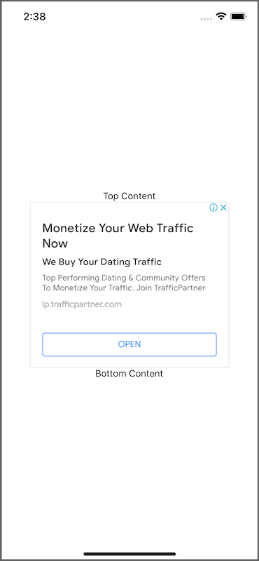

# react-native-google-ads-webview

react-native-google-ads-webview



## Installation

```sh
npm install react-native-google-ads-webview
```

### iOS

#### Update your Info.plist

Update your app's Info.plist to complete Google Mobile Ads SDK installation

```xml
<!-- Bypass GADApplicationIdentifier check for WebView API for Ads -->
<key>GADIntegrationManager</key>
<string>webview</string>
```

### Android

Nothing to do here

## Usage

```js
import { GoogleAdsWebviewView } from 'react-native-google-ads-webview';

// ...

<GoogleAdsWebviewView
  style={{ width: 300, height: 250 }}
  adHost="{{ad-host}}"
  adClient="{{ad-client}}"
  pageUrl="http://www.example.com"
/>;
```

## API Reference

### adHost

```js
adHost: string;
```

Your ad-host parameter.

### adClient

```js
adClient: string;
```

Your ad unit ad-client parameter.

### pageUrl

```js
pageUrl: string;
```

Page url for reporting purposes. You can send the domain instead of setting the complete data-page url if you don’t know it.

### adSlot

```js
adSlot?: string
```

Your ad unit ad-slot parameter.

### onUnfilledAd

```js
onUnfilledAd?: () => void;
```

Triggered when AdSense were unable to filled the ad slot with an ad creative.

## Example App

Go into the example app subdirectory:

```console
cd react-native-google-ads-webview/example
```

### Android

```console
yarn android
```

### iOS

Extra installation step needed in case of clean checkout only:

```console
cd ios && pod install && cd ..
```

Then:

```console
yarn ios
```

## License

MIT
